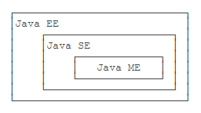
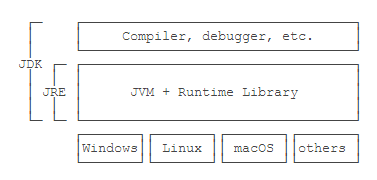

[TOC]

## Java 简介

### Java 版本

- Java SE：Standard Edition，标准版，包含标准的 JVM 和标准库，是整个Java平台的核心。

- Java EE：Enterprise Edition，企业版，在Java SE的基础上加上了大量的API和库，以便方便开发Web应用、数据库、消息服务等。

- Java ME：Micro Edition，针对嵌入式设备的“瘦身版”，其虚拟机和库都与 Java EE不同。

  <div align="center">
      
  </div>

### 名词解释

- JDK：Java Development Kit，包含 JRE 和 Java 的开发工具（编译器、调试器等）。

- JRE：Java Runtime Environment，运行 Java 字节码的虚拟机。

  <div align="center">
      
  </div>

### 安装 JDK

[Oracle 官网下载](https://www.oracle.com/technetwork/java/javase/downloads/index.html)

安装完成后配置环境变量和

#### 配置环境变量

`JAVA_HOME=%安装路径%\Java|jdk` 

JAVA_HOME 指向JDK的安装目录，Eclipse/Tomcat 等 JAVA 开发的软件通过搜索 JAVA_HOME 变量来找到并使用安装好的 JDK。

`PATH=%JAVA_HOME%\bin`

PATH 指向搜索命令路径，bin 路径下包含了常用的可执行文件，如 javac/ java 等。

`CLASSPATH:.;%JAVA_HOME%\lib\dt.jar;%JAVA_HOME%\lib\tools.jar `

CLASSPATH指向类搜索路径，与import, package 关键字有关。

如配置成功，输入命令`java -version`，会得到如下输出：

```
$ java -version
java version "11.0.2" 2019-01-15 LTS
Java(TM) SE Runtime Environment 18.9 (build 11.0.2+9-LTS)
Java HotSpot(TM) 64-Bit Server VM 18.9 (build 11.0.2+9-LTS, mixed mode)
```

PATH 下的常用可执行文件

- javac：这是 Java 的**编译器**，它用于把 Java 源码文件（以`.java`后缀结尾）编译为 Java 字节码文件（以 `.class` 后缀结尾）；
- java：启动 JVM，即运行 Java 程序，让 JVM 执行指定 Java 字节码文件；
- jar：用于把一组 `.class `文件打包成一个 `.jar` 文件，便于发布；
- javadoc：用于从Java源码中自动提取注释并生成文档；
- jdb：Java 调试器，用于开发阶段的运行调试。

#### 运行 Java 程序

1. 在文本编辑器中输入 Java 代码，保存为 `类名.java` 的格式

2. 使用 `javac` 可以将 `.java` 源码编译成 `.class`字节码；

   ```
   $ javac Hello.java
   ```

3. 使用 `java` 运行一个已编译的 Java 程序，参数是类名。

   ```
   $ java Hello
   Hello, world!
   ```

#### IDE

IDE是集成开发环境 (Integrated Development Environment) 的缩写，可以把编写代码、组织项目、编译、运行、调试等放到一个环境中运行，能极大地提高开发效率。

这里使用 Eclipse 。

## Java 程序基础

基本类型的变量是“持有”某个数值，只表示简单的字符或数字，JVM 会为其分配数据类型实际占用的内存空间。

引用类型的变量是“指向”某个对象，可以表示复杂的数据类型，是指向堆区某个实例的指针。

Java的字符类型 `char` 是基本类型，字符串类型 `String` 是引用类型。

### 基本类型

| 基本类型 | 位数 / bit | 默认值    | 缓存值           | 包装类型  |
| -------- | ---------- | --------- | ---------------- | --------- |
| boolean  | 1          | false     | true, false      | Boolean   |
| byte     | 8          | 0         | all byte value   | Byte      |
| char     | 16         | ‘ u0000 ' | \u0000 to \u007F | Character |
| short    | 16         | 0         | -128 ~ 127       | Short     |
| int      | 32         | 0         | -128 ~ 127       | Interger  |
| long     | 64         | 0 L       |                  | Long      |
| float    | 32         | 0.0 f     |                  | Float     |
| double   | 64         | 0.0       |                  | Double    |

#### 缓存池

参考[IntegerCache](https://blog.csdn.net/weixin_40243894/article/details/81279762)

Integer内部维护着IntegerCache的一个内部类，IntegerCache有一个静态的Integer数组，数组大小默认为**[-128,127]**。在类加载时就将-128 到 127 的Integer对象创建了，并保存在cache数组中。

- `new Integer(1)` 每次都会新建一个对象
- `Integer.valueOf(1)` 会先判断值是否在缓存池中，若在则直接返回缓存值
- `Integer x = 1` 会自动装箱，而编译器会在自动装箱过程中调用 valueOf() 方法

```java
//IntegerCache大小默认为[-128,127]
Integer x = 1;//自动装箱
Integer y = 1;
System.out.println(String.format("1:%s",x == y));// ture，调用缓存池对象
x = 127;
y = 127;
System.out.println(String.format("2:%s",x == y));// ture，调用缓存池对象
x = 128;
y = 128;
System.out.println(String.format("3:%s",x == y));// false，超出127，新建两个不同的Integer对象
//这里会出现警告，构造函数 Integer(int) 在 java9 之后就不推荐使用了
Integer x1 = new Integer(1);
Integer y1 = new Integer(1);
System.out.println(String.format("4:%s",x1 == y1));// false，new Intege方法新建的两个对象
x1 = Integer.parseInt("127");
y1 = Integer.parseInt("127");
System.out.println(String.format("5:%s",x1 == y1));// ture, parstInt()方法返回的是int基本类型,自动装箱，就变成了Integer x = 127,调用了valueOf方法
x1 = Integer.parseInt("128");
y1 = Integer.parseInt("128");
System.out.println(String.format("6:%s",x1 == y1));// false，超出127    
Integer x2 = Integer.valueOf(1);
Integer y2 = Integer.valueOf(1);
System.out.println(String.format("7:%s",x2 == y2));	//true，调用缓存池中的同一对象
```

### 引用类型

#### String

##### null 和空字符串

`String a = null` ：声明一个字符串类型的引用，但指向为null，即还没有指向任何的内存空间。 
`String s = ""` ：声明一个字符串类型的引用，其值为 “” 空字符串，这个 s 引用指向的是空字符串的内存空间。

##### [判断字符串是否为空：](https://blog.csdn.net/wilson_m/article/details/79120347 )

`if (s == null || s.length() == 0);  `

如果 String 类型为 null , 而去进行 length() 等操作会抛出 java.lang.NullPointerException，故首先要判断 s == null ，且顺序必须出现在前面。

##### 字符串不可变

String 类被声明为 final，不可继承。Java 9 之后，改用 byte 类型的 value 数组存储字符串，value 数组被声明为 final，且没有改变 value 数组的方法，保证了 String 不可变。

```java
public class Main {
    public static void main(String[] args) {
        String s = "hello";//字符串变量 s 指向"hello"
        String t = s;//t = "hello"
        s = "world";//s = "world"
        System.out.println(t); // t = "hello"
    }
}
```

[不可变的好处](<https://cyc2018.github.io/CS-Notes/#/notes/Java%20%E5%9F%BA%E7%A1%80?id=%e4%b8%8d%e5%8f%af%e5%8f%98%e7%9a%84%e5%a5%bd%e5%a4%84>)

- 可以缓存 hash 值
- String Pool 的需要
- 安全性
- 线程安全

##### String，StringBuilder，StringBuffer

- String，不可变，线程安全
- StringBuilder，可变，不是线程安全的
- StringBuffer，可变，线程安全，内部使用synchronized进行同步

##### [String Pool](<https://www.jianshu.com/p/f3dbe3d57680>)

**new 方法是在堆上创建对象和数组的**

`new String("aaa")` 

- 系统先在字符串常量池里面寻找是否有一个"abc"的字符串，

- 如果有的话，则在堆中复制一个该字符串，并且将堆中的引用指向s,这个时候系统只创建了一个对象，即**堆中的对象**；

- 如果没有的话，则会先在字符串常量池中先创建一个字符串为"abc"的常量，然后再复制到堆里面，最后将堆所在的地址指向s，这个时候创建了两个对象；

`String s = "bbb";` 

- 系统先在字符串中寻找是否存在"abc"的常量
- 如果存在，则直接将该"abc"在常量池中的地址指向s，这个时候，系统没有创建新对象。
- 如果不存在，则在常量池中新建一个"abc"并放入常量池里面，然后再返回该地址，这个时候，系统创建了一个对象。

`s.intern()` 

- 如果 String Pool 中已经存在一个字符串和 s 引用的字符串值相等（使用 equals() 方法进行确定），那么就会返回 String Pool 中字符串的引用；
- 否则在 String Pool 中添加一个新的字符串，并返回这个新字符串的引用。

[示例](<https://cyc2018.github.io/CS-Notes/#/notes/Java%20%E5%9F%BA%E7%A1%80?id=string-pool>)

```java
String s1 = new String("aaa");
String s2 = new String("aaa");
System.out.println(s1 == s2);  // false
String s3 = s1.intern();
String s4 = s1.intern();
System.out.println(s3 == s4);  // true
String s5 = "bbb";
String s6 = "bbb";
System.out.println(s5 == s6);  // true
```

#### 数组

数组一旦创建后，大小就不可变；数组元素可以是值类型（如int）或引用类型（如String），但数组本身是引用类型；

```java
//数组元素为值类型
ns = new int[] { 68, 79, 91, 85, 62 };
```


```java
//数组元素为引用类型
String[] names = {
    "ABC", "XYZ", "zoo"
};
```


### 关键字

- var 用于省略变量类型

  ```java
  var sb = new StringBuilder();
  //编译器会自动判断为下面的语句
  StringBuilder sb = new StringBuilder();
  ```


### 整数运算

#### 溢出

整数计算结果超出了范围，就会产生溢出，而溢出**不会出错**，但会得到一些奇怪的答案。

这里需要了解[反码、补码](<https://www.cnblogs.com/flowerslip/p/5933833.html>)

正数：补码 = 反码 =原码

负数：反码 = 原码（符号位不变）其余位取反

​	    补码 = 反码 + 1

最小值的特殊情况：

以 byte 为例，一个字节，8 bit，取值范围是 -128 ~ 127，但是**-128只有补码** **（1000 0000）**

#### 运算符号

##### 自增/自减

`++n` 表示先加 1 再引用 n，`n++` 表示先引用 n 再加 1。

##### 移位运算

<< : 左移运算符，符号位不动，num << 1,相当于 num 乘以2

\>> : 右移运算符，符号位不动，num >> 1,相当于 num 除以2

\>>> : 无符号右移，忽略符号位，空位都以0补齐

[移位运算比乘除运算的性能更高](<https://blog.csdn.net/zhou_zhou_gogo1/article/details/84246328>)，故与 2^k^ 的乘除法运算可以转换为移位运算。

除法运算向 0 取整，右移运算向 下取整，如下所示，对于正数 a，所得结果一样；对于负数 b，结果是不同的。

```java
    public static void main(String[] args) {
        int a = 7;
        int b = -7; 
        int a1 = a >> 1;
        int b1 = b >> 1;
        System.out.println("a / 2 = " + a/2);//a / 2 = 3
        System.out.println("a >> 1 = " + a1 );//a >> 1 = 3
        System.out.println("b / 2 = " + b/2);//b / 2 = -3
        System.out.println("b >> 1 = " + b1 );//b >> 1 = -4        
    }
```

##### 逻辑运算符

&（与），&&（短路与），|（或），||（短路或），^（异或）

布尔运算的一个重要特点是**短路运算**。如果一个布尔运算的表达式能提前确定结果，则后续的计算不再执行，直接返回结果。

因为`false && x`的结果总是`false`，无论`x`是`true`还是`false`，因此，与运算在确定第一个值为`false`后，不再继续计算，而是直接返回`false`。

### 输出输入

#### 输出

`print` 表示输出后不换行；

`println` 是print line的缩写，表示输出并换行；

`printf`表示格式化输出，通过使用占位符`%?`，把后面的参数格式化成指定格式。

Eclipse 中输入 syso ,再按 alt + '/' 可快速输入 System.out.println( ) 。

| 占位符 | 说明                             |
| :----- | :------------------------------- |
| %d     | 格式化输出整数                   |
| %x     | 格式化输出十六进制整数           |
| %f     | 格式化输出浮点数                 |
| %e     | 格式化输出科学计数法表示的浮点数 |
| %s     | 格式化字符串                     |

#### 输入

[java中从键盘输入的三种方法](<https://blog.csdn.net/u012249177/article/details/49586383>)

1. System.in 和 System.out 方法
2. InputStreamReader 和 BufferedReader 方法
3. Scanner 类中的方法（首先要创建一个 Scanner 对象，再调用方法）

```java
import java.util.Scanner;

public class Main {
    public static void main(String[] args) {
        Scanner scanner = new Scanner(System.in); // 创建Scanner对象
        String name = scanner.nextLine(); // 读取一行输入并获取字符串
        int age = scanner.nextInt(); // 读取一行输入并获取整数
    }
}
```

### if 判断

#### 浮点数的判断

浮点数在计算机中常常无法精确表示，并且计算可能出现误差，因此，判断浮点数相等不能直接用 `==` 判断。正确的方法是利用差值小于某个临界值来判断：

```java
public class Main {
    public static void main(String[] args) {
        double x = 1 - 9.0 / 10;
        if (Math.abs(x - 0.1) < 0.00001) {
            System.out.println("x is 0.1");
        } else {
            System.out.println("x is NOT 0.1");
        }
    }
}
```

#### 判断引用类型相等

`==` 表示引用类型是否指向**同一个对象**。

`equals()` 方法判断引用类型的**变量内容**是否相等。

注意：执行语句 `s1.equals(s2)` 时，如果变量 `s1` 为 `nul ` ，会报 `NullPointerException` 。

```java
//正确的做法加上 s1 != null
public class Main {
    public static void main(String[] args) {
        String s1 = null;
        if (s1 != null && s1.equals("hello")) {
            System.out.println("hello");
        }
    }
}

```

### switch

`case` 语句具有 ”穿透性“ ，漏写 `break` 会造成严重的逻辑错误，而且不易在源代码中发现错误。从 Java 12 开始，`switch` 语句升级为更简洁的表达式语法，使用类似模式匹配（Pattern Matching）的方法，保证只有一种路径会被执行，没有穿透效应，故不需要 `break` 语句：

```java
public class Main {
    public static void main(String[] args) {
        String fruit = "apple";
        switch (fruit) {
        case "apple" -> System.out.println("Selected apple");
        case "pear" -> System.out.println("Selected pear");
        case "mango" -> {
            System.out.println("Selected mango");
            System.out.println("Good choice!");
        }//多条语句用 {} 括起来
        default -> System.out.println("No fruit selected");
        }
    }
}
```

## 面向对象

### 方法

封装性，隐藏对象的属性和实现细节，只提供公共访问方式

```java
public class Main {
    public static void main(String[] args) {
        Person ming = new Person();
        ming.setBirth(2008);
        System.out.println(ming.getAge());
    }
}

class Person {
    private String name;//外部无法访问
    private int birth;//外部无法访问

    public void setBirth(int birth) {
        this.birth = birth;
    }

    public int getAge() {
        return calcAge(2019); // 调用private方法
    }

    // private方法，外部无法调用
    private int calcAge(int currentYear) {
        return currentYear - this.birth;
    }
}
```

### 构造方法

构造方法的名称就是类名。构造方法的参数没有限制，在方法内部，也可以编写任意语句。但是，和普通方法相比，构造方法没有返回值（也没有 `void` ），调用构造方法，必须用 `new` 操作符。

如果一个类没有定义构造方法，编译器会自动为我们生成一个默认构造方法，它没有参数，也没有执行语句。

可以同时存在多个构造方法，方法的**重载**。

```java
class Person {
	//默认的构造方法
    public Person() {
    }
    //自定义构造方法
    public Person(String name, int age) {
        this.name = name;
        this.age = age;
    }
}
```

### 重载与重写

#### 重载

存在于同一个类中，指一个方法与已经存在的方法名称上相同，但是参数类型、个数、顺序至少有一个不同。

应该注意的是，返回值不同，其它都相同不算是重载。

#### 重写

存在于继承体系中，指子类实现了一个与父类在方法声明上完全相同的一个方法。

为了满足里式替换原则，重写有以下三个限制：

- 子类方法的访问权限必须大于等于父类方法；
- 子类方法的返回类型必须是父类方法返回类型或为其子类型。
- 子类方法抛出的异常类型必须是父类抛出异常类型或为其子类型。

使用 @Override 注解，可以让编译器帮忙检查是否满足上面的三个限制条件。

### 继承

任何类，除了 `Object`，都会继承自某个类，未明确注明 `extends` 的类，编译器会自动加上 `extends Object`。

任何`class`的构造方法，第一行语句必须是调用父类的构造方法。如果没有明确地调用父类的构造方法，编译器会帮我们自动加一句`super();`

子类不会继承任何父类的构造方法。子类默认的构造方法是编译器自动生成的，不是继承的。

### 多态

子类可以覆写父类的方法（Override），覆写在子类中改变了父类方法的行为。

Java 的实例方法调用是基于**运行时的实际类型的动态调用**，而非变量的声明类型。

```java
public class Main {
    public static void main(String[] args) {
    //引用类型为 Person，实际类型为 Student
    	Person p = new Student();
        p.run(); // 打印Student.run
    }
}

class Person {
    public void run() {
        System.out.println("Person.run");
    }
}

class Student extends Person {
    @Override
    public void run() {
        System.out.println("Student.run");
    }
}
```

**多态的特性：运行期才能动态决定调用的子类方法。**

```java
//无法确定传入参数 p 的实际类型是 Person 还是 Student 
public void runTwice(Person p) {
    //无法确定调用的是哪个类的 run()方法
    p.run();
    p.run();
}
```

### 抽象类

如果父类的方法本身不需要实现任何功能，仅仅是为了定义方法签名，目的是让子类去覆写它，那么，可以把父类的方法声明为抽象方法：

```java
class Person {
    public abstract void run();
}
```

使用 `abstract` 修饰的类就是抽象类。我们无法实例化一个抽象类，抽象类本身被设计成只能用于被继承。

通过 `abstract` 定义的方法是抽象方法，它只有定义，没有实现。抽象方法定义了子类必须实现的接口规范。

通过`abstract`定义的方法是抽象方法，它只有定义，没有实现，不能被实例化。抽象方法定义了子类必须实现的接口规范；

```java
public class Main {
    public static void main(String[] args) {
        Person p = new Student();
        p.run();
    }
}

abstract class Person {
    public abstract void run();
}

class Student extends Person {
    @Override
    public void run() {
        System.out.println("Student.run");
    }
}
```

#### 面向抽象编程

是一种引用高层类型，避免引用实际子类型的方式。

- 上层代码只定义规范（例如：`abstract class Person`）；
- 具体的业务逻辑由不同的子类实现，调用者并不关心。
- 只关心抽象方法的定义，不关心子类的具体实现。

```java
Person s = new Student();
// 不关心Person变量的具体子类型:
s.run();
```

### 接口

接口中不能有字段，定义的方法默认都是 `public abstract` 。

一个类只能继承另一个类，但可以实现多个接口，使用关键字 `implements` ；

一个接口可以继承另一个接口，使用关键字 `extends` 。

```java
interface Hello {
    void hello();
}
//一个接口继承另一个接口, extends
interface Person extends Hello {
    void run();
}
//一个类实现多个接口,implements
class Student implements Person, Hello {
    private String name;

    public Student(String name) {
        this.name = name;
    }

    @Override
    public void hello() {
        System.out.println(this.name + " hello");
    }
    
    @Override
    public void run() {
        System.out.println(this.name + " run");
    }
    
}
```

术语区分：Java 的接口特指 `interface` 的定义，表示一个接口类型和一组方法签名，而编程接口泛指接口规范，如方法签名，数据格式，网络协议等。

**[default方法](<https://blog.csdn.net/qq_35835624/article/details/80196932>)**

从 JDK 1.8 之后，接口可以定义 `default` 方法，实现类可以不必覆写`default` 方法；当同时继承的两个接口中都定义了相同 `default` 方法，不知道调用哪个接口中的 `default` 方法，需要在实现类中重新实现该方法；当继承的父类和一个接口中定义了同一个方法，这时候实现类调用父类的方法，因为**类优先于接口**。

`default`方法和抽象类的普通方法是有所不同的。因为`interface`没有字段，`default`方法无法访问字段，而抽象类的普通方法可以访问实例字段。

### 静态字段和静态方法

#### 静态字段

```java
class Person {
    //定义实例字段 name:
    public String name;
    // 定义静态字段 number:
    public static int number;
}
```

- 实例字段：在 class 中定义的字段，每个实例都有独立的字段，各个实例的同名字段互不影响。
- 静态字段：用 `static` 修饰的字段，所有实例共享同一个静态字段。修改一个实例的静态字段，会改变所有实例的静态字段，因为本质上都是同一个字段。
- 不推荐用 `实例变量.静态字段` (hong.number) 去访问静态字段，因为在Java程序中，实例对象并没有静态字段；推荐用 `类名.静态字段` (Person.number) 来访问。把静态字段理解为描述 `class` 本身的字段（非实例字段）。

```java
public class Main {
    public static void main(String[] args) {
        Person ming = new Person("Xiao Ming", 12);
        Person hong = new Person("Xiao Hong", 15);
        ming.number = 88;
        System.out.println(hong.number);//88
        hong.number = 99;
        System.out.println(ming.number);//99
    }
}

class Person {
    public String name;
    public int age;

    public static int number;//静态变量

    public Person(String name, int age) {
        this.name = name;
        this.age = age;
    }
}
```

#### 静态方法

用 `static` 修饰的方法

调用实例方法必须通过一个实例变量，而调用静态方法直接通过类名就可以调用。

因为静态方法属于`class`而不属于实例，因此，静态方法内部，无法访问`this`  变量，也无法访问实例字段，它只能访问静态字段。

```java
public class Main {
    public static void main(String[] args) {
        //直接通过 类名.方法名 调用静态方法
        Person.setNumber(99);
        System.out.println(Person.number);
    }
}

class Person {
    public static int number;
    //静态方法
    public static void setNumber(int value) {
        number = value;
    }
}
```

#### 接口的静态字段

接口不能定义实例字段，但可以有静态字段，默认为 `public static final` 类型。

### 包

Java内建的`package`机制是为了避免`class`命名冲突；

JDK的核心类使用`java.lang`包，编译器会自动导入；

JDK的其它常用类定义在`java.util.*`，`java.math.*`，`java.text.*`，……；

包名推荐使用倒置的域名，例如`org.apache`。

### 作用域

一个`.java`文件只能包含一个`public`类，但可以包含多个非`public`类。如果有`public`类，文件名必须和`public`类的名字相同。

[Java变量作用域](https://blog.csdn.net/bupa900318/article/details/80555929)
[Java变量和对象的作用域](https://www.cnblogs.com/AlanLee/p/6627949.html)

#### 类级变量（全局变量、静态变量）
需要使用static关键字修饰。类级变量在类定义后就已经存在，占用内存空间，可以通过类名来访问，不需要实例化。
#### 对象实例级变量（成员变量）
实例化后才会分配内存空间，才能访问。成员变量是定义在方法之外，类之内的。成员变量随着对象的创建而存在，随着对象的消失而消失。
#### 方法级变量（局部变量）
局部变量在调用了对应的方法，执行到了创建该变量的语句时存在，局部变量的作用域从它被声明的点开始，一旦出了自己的作用域马上从内存中消失。
#### 块级变量
定义在一个块内部的变量，变量的生存周期就是这个块，出了这个块就消失了，比如 if、for 语句的块。块是指由大括号包围的代码。
#### 其他说明
- 方法内部除了能访问方法级的变量，还可以访问类级和实例级的变量
- 块内部能够访问类级、实例级变量，如果块被包含在方法内部，它还可以访问方法级的变量
- 类级变量和成员变量是有默认的初始值
- 方法级和块级的变量没有默认的初始值，必须被显示地初始化，否则不能访问

## Java 核心类

### 拼接字符串

`StringJoiner (CharSequence delimiter, CharSequence prefix,  CharSequence suffix)` 的第二个和第三个参数分别是拼接后的字符串的前缀和后缀。

### 包装类

包装类是**引用类型**，用 final 声明，具有**不可变性**。

在编译期自动完成自动装箱和自动拆箱；整数和浮点数的包装类型都继承自 `Number`。

### JavaBean

符合下面两条规范的 class 称为 JavaBean

- 若干`private`实例字段；
- 通过`public`方法来读写实例字段。

```java
public class Person {
    private String name;
    private int age;

    public String getName() { return this.name; }
    public void setName(String name) { this.name = name; }

    public int getAge() { return this.age; }
    public void setAge(int age) { this.age = age; }
}
```

### 枚举类

Java 使用 `enum` 定义枚举类型，它被编译器编译为 `final class Xxx extends Enum { … }`，本质上就是 class

，引用类型，但其实例不能通过 new 创建，只能通过如下方式定义实例：

```java
enum Weekday {
    SUN, MON, TUE, WED, THU, FRI, SAT;
}
```

引用类型比较，要使用 `equals()` 方法，如果使用 `==` 比较，它比较的是两个引用类型的变量是否是**同一个对象**。但` enum` 类型的每个常量在 JVM 中只有一个唯一实例，所以可以直接用 `==` 比较。

### BigInteger

`java.math.BigInteger` 用来表示任意大小的整数，`BigInteger `内部用一个 `int[]` 数组来模拟一个非常大的整数，是不变类，继承自 `Number`。

### BigDecimal

和`BigInteger`类似，`BigDecimal`可以表示一个任意大小且精度完全准确的浮点数。

`scale()` 方法可以返回小数位数。

#### 判断相等

`equals()`方法：要求两个 `BigDecimal` 的值相等，还要求它们的 `scale()` 相等；

`compareTo()`方法：推荐这种方法比较 `BigDecimal` 的值。

## 异常处理

### 异常

Java使用异常来表示错误，并通过 `try ... catch` 捕获异常；

Java的异常是 `class` ，并且从 `Throwable` 继承；

`Error` 是无需捕获的严重错误，`Exception `是应该捕获的可处理的错误；

`RuntimeException` 无需强制捕获，非 `RuntimeException`（Checked Exception）需强制捕获，或者用 `throws` 声明。

### 捕获异常

JVM在捕获到异常后，会按序匹配某个 `catch` 语句并执行，然后不再继续匹配，即多个 `catch` 语句只有一个能被执行。

#### finally 语句

finally 语句，不是必须要写的。用来保证一些代码必须执行，无论是否捕捉到异常，finally 语句都会被执行

```java
public static void main(String[] args) {
    try {
        process1();
        process2();
        process3();
    } catch (UnsupportedEncodingException e) {//如果捕捉到异常，执行对应的 catch 语句
        System.out.println("Bad encoding");
    } catch (IOException e) {
        System.out.println("IO error");
    } finally {//无论是否捕捉到异常，finally 语句都会被执行
        System.out.println("END");
    }
}
```

### 抛出异常

当某个方法抛出了异常时，如果当前方法没有捕获异常，异常就会被抛到上层调用方法，直到遇到某个 `try ... catch` 被捕获为止，这时可以通过 `printStackTrace()` 可以打印出方法的调用栈：

```java
public class Main {
    public static void main(String[] args) {
        try {
            process1();//再抛到上一层调用方法 main() 中，异常被捕获
        } catch (Exception e) {
            e.printStackTrace();
        }
    }

    static void process1() {
        process2();//抛到上一层调用方法 process1() 中，还是没有捕获该异常
    }

    static void process2() {
        Integer.parseInt(null); // process2()中 抛出NumberFormatException，没有捕获该异常
    }
}

```

## Object 通用方法

### 等价与相等

- 对于基本类型，== 判断两个值是否相等，基本类型没有 equals() 方法。
- 对于引用类型，== 判断两个变量是否引用同一个对象，而 equals() 判断引用的对象是否等价。

### hashCode()

[hashcode() 与 equals() 的作用及区别](<https://blog.csdn.net/haobaworenle/article/details/53819838>)

- hashCode 是为了提高在散列结构存储中查找的效率，在线性表中没有作用；
- equals 和 hashCode 需要同时覆盖，保证等价的两个对象的散列值也相等

### clone()

[clone() 方法的实现](<https://www.jianshu.com/p/04ff0a7bf52b>)

#### **浅拷贝**

拷贝对象和原始对象的引用类型引用同一个对象。

#### **深拷贝**

拷贝对象和原始对象的引用类型引用不同对象。

#### clone() 的替代方案

使用 clone() 方法来拷贝一个对象即复杂又有风险，它会抛出异常，并且还需要类型转换。Effective Java 书上讲到，最好不要去使用 clone()，可以使用拷贝构造函数或者拷贝工厂来拷贝一个对象。

[示例](<https://cyc2018.github.io/CS-Notes/#/notes/Java%20%E5%9F%BA%E7%A1%80?id=clone>)

## 参考资料

[CS-Notes](<https://cyc2018.github.io/CS-Notes/#/>)

[Java 教程](<https://www.liaoxuefeng.com/wiki/1252599548343744>)